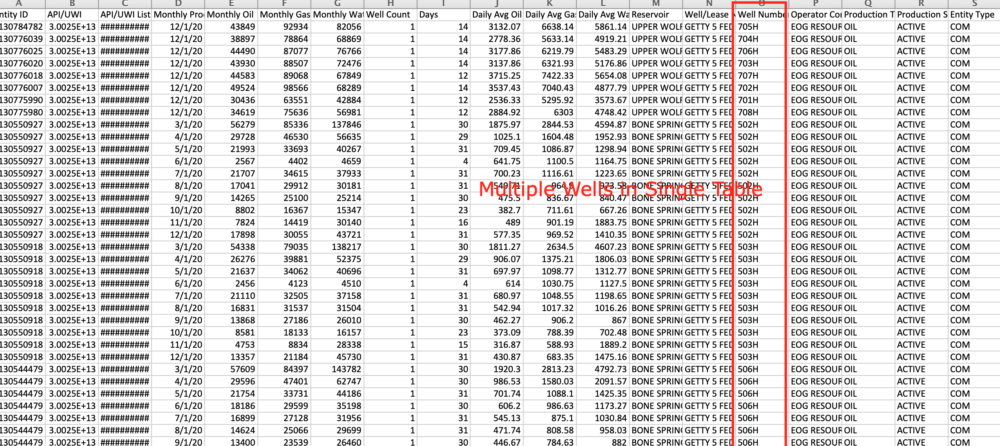

# Script Goal

1.  The script will transform production data from Enverus/DrillingInfo to digestable Excel sheets for the accounting department
2.  Raw export has multiple wells within a single table
    * The script will loop through each well name, copy its production, and save it as a new tab in an Excel workbook


# Libraries Used

Pandas


# Code Snippets

```python

for name in bookNames:
    
    #creating blank workbook to store each well as new tab within workbook
    initialize_workbook = openpyxl.Workbook()
    initialize_workbook.save('Data/{}/{}.xlsx'.format(projectFolderName, name.title()))
    
    #filtering list of well names that pertain to book name
    for sheet in list(filter(lambda s_name: name in s_name , leaseNames)):

        #using openpyxl to load workbook
        loadBook = openpyxl.load_workbook('Data/{}/{}.xlsx'.format(projectFolderName, name.title()))
        
        #writing to specific workbook with pandas
        writer = pd.ExcelWriter('Data/{}/{}.xlsx'.format(projectFolderName, name.title()), engine = 'openpyxl')
        writer.book = loadBook
        
        #getting production information for the desired well
        tempDF = monthlyDF[monthlyDF["Abbrev Well Name"]==sheet]
        tempDF[columnOrder].to_excel(writer, sheet_name = '{}'.format(sheet), index = False)
        
        writer.save()
        
    #cleaning up blank sheet by removing it   
    loadBook.remove(loadBook["Sheet"])   
    
    for finishedSheet in loadBook.sheetnames:
        set_col_width(loadBook[finishedSheet])
    
    #closing workbook after adding all sheets necessary
    writer.close()

```


# Screenshots

<h3> Raw Data Excel Screenshot </h3>



---
<h3> Output Data Excel Screenshot </h3>


